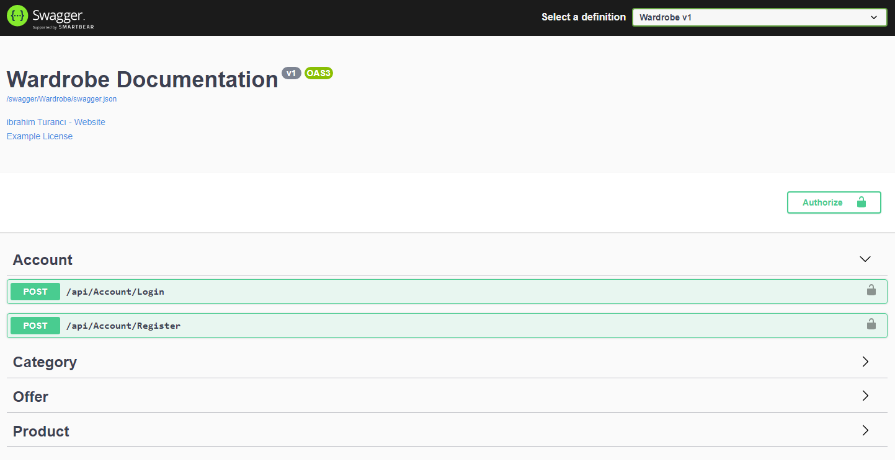
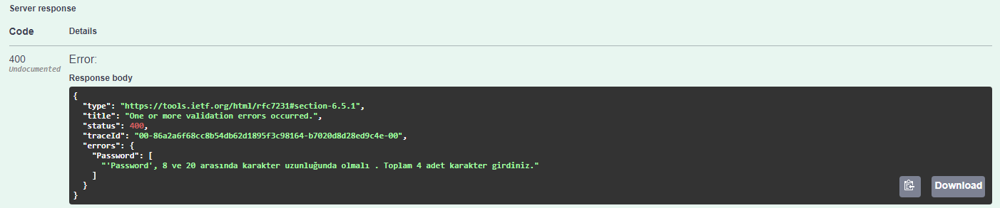
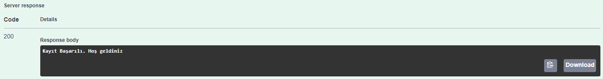
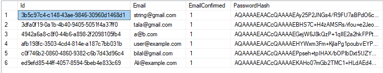
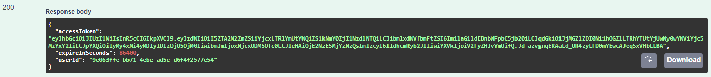
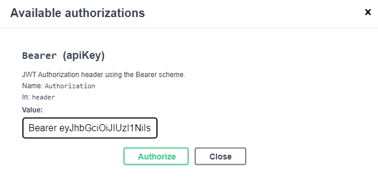
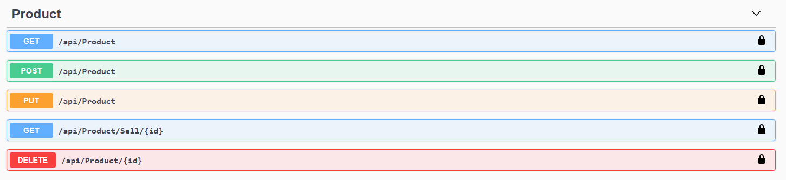
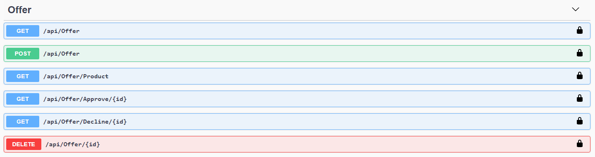
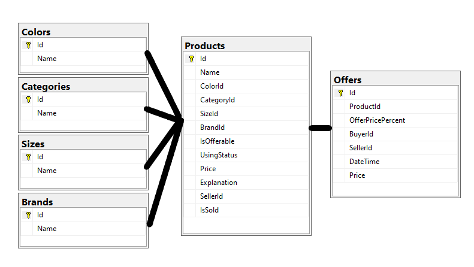

# Wardrobe Web Api

Bu proje günümüzde kullanılan e-ticaret sitelerinin API katmanına örnek olarak hazırlanmıştır.
Projeyi indirip Sql servera backup dosyasını kurduktan sonra projenin startup kısmında kendi server
bilgilerinizi girerek çalıştırabilirsiniz.

---

### Table of Contents

- [Teknolojiler ve Yapılar](#builtwith)
- [Kayıt ve Giriş](#account)
- [Controller](#controller)
- [Database](#database)

---
## Genel Görünüm 

## Builtwith

- [C#](https://learn.microsoft.com/en-us/dotnet/csharp/)
- [ASP .NET Core](https://docs.microsoft.com/en-us/aspnet/core/?view=aspnetcore-5.0) Web Api
- [Entity Framework Core](https://docs.microsoft.com/en-us/ef/core/), GenericRepository ve UnitOfWork (Veriye Erişim)
- [AutoMapper](https://automapper.org/)
- [MSSQL Server](https://www.microsoft.com/en-us/sql-server/sql-server-downloads) (Database)
- [Fluent Validation](https://fluentvalidation.net/) (Validasyonlar)
- [JWT](https://jwt.io/) (Kimlik Doğrulama)

[Back To The Top](#wardrobe-web-api)

---
## Account
 Kayıt 
 - Ad ve soyad alanı boş bırakılamaz.
 - En az 8 ve en fazla 20 karakter uzunluğunda bir password girilmeli
 - Validasyonlar geçilirse kullanıcıya başarılı, geçilmeze hata mesajı dönülür.
 - Kullanıcı şifreleri veritabanında hashing ve aynı şifreye sahip kullanıcılar için salting uygulanarak gizlenmiş olarak tutulur.

## Hatalı Kayıt

## Başarılı Kayıt

## PasswordHash

## Başarılı Giriş

Giriş ile beraber bir token üretilir.Token süresi 1 gün (86400 saniye) olarak ayarlanmıştır. Swagger Authorize sekmesi üzerinden kimlik doğrulama gerektiren işlemler için Header'a Bearer token eklenir.

[Back To The Top](#wardrobe-web-api)

---
## Controller
 - AccountController (Kayıt ve Giriş İşlemleri)
 - CategoryController (Kategori Listesi, Kategori Ekleme, Kategoriye ait ürünleri Listeleme)
 - OfferController (Giriş yapan kullanıcıya gelen teklifler, Teklif verme, Gelen teklifi onaylama-red etme) 
 - ProductController (Ürün Listesi, Ürün Ekleme-Güncelleme, Silme)

Kullanıcılar giriş yapmadan : 
  -  Tüm ürünleri listeyebilir.
  -  Her ürünün detayına ulaşabilir.

 Kullanıcılar giriş yaptıktan sonra :
  -  Ürün ekleyebilir.  
  -  Kendi ürünlerine ulaşabilir.
  -  Sadece kendine ait ürünü güncelleyebilir ya da silebilir.
  -  Kendilerine ait olmayan diğer ürünleri satın alabilir.
     

 Kullanıcılar giriş yaptıktan sonra :
  -  Teklif verebilir.  
  -  Verilen teklifleri listeleyebilir.
  -  Kendine ait olmayan ürüne teklif verebilir.
  -  Kendine gelen teklifleri onaylayabilir ya da reddebilir.

[Back To The Top](#wardrobe-web-api)

---
## Database

Ürüne bağlı tablolar.

[Back To The Top](#wardrobe-web-api)